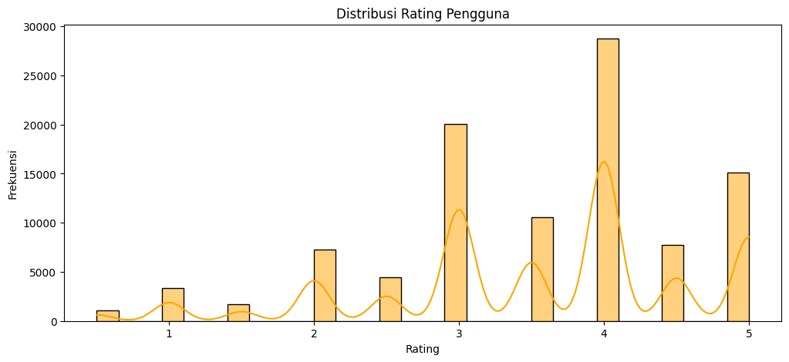
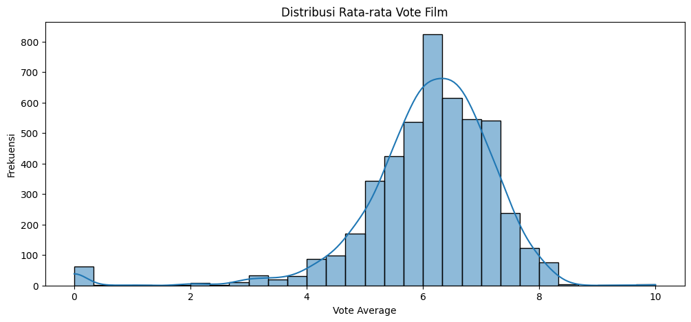
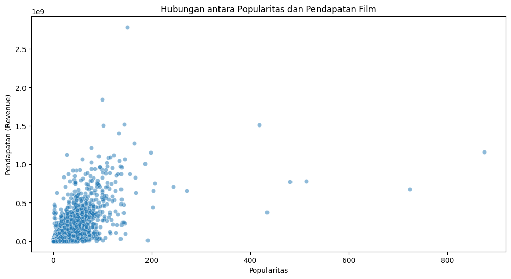
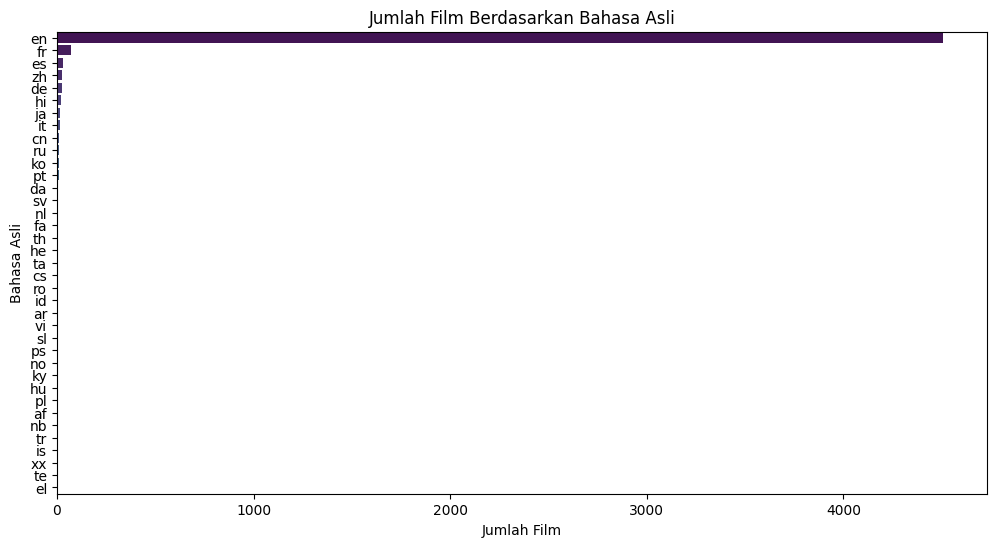
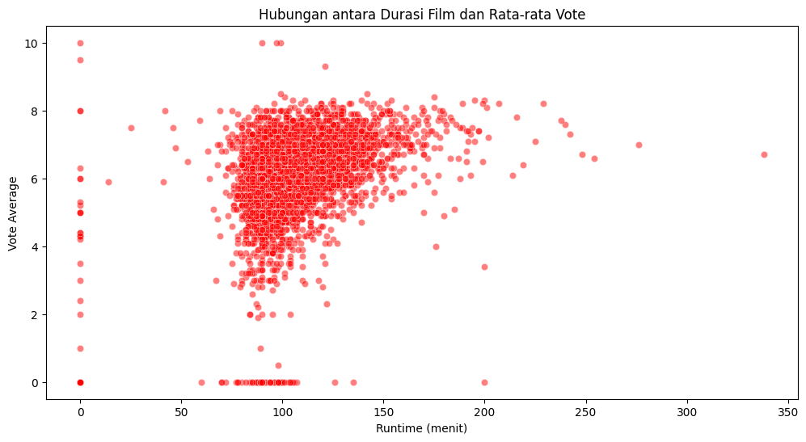
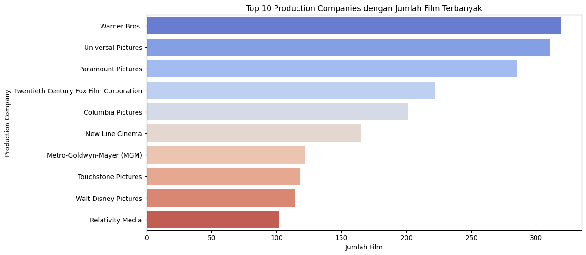
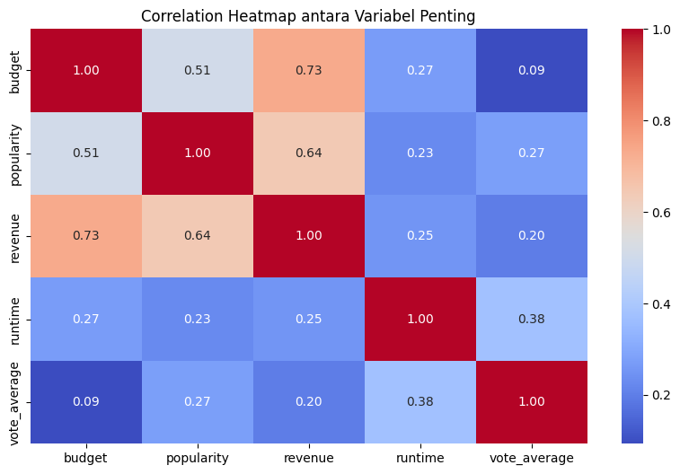

# Laporan Proyek Machine Learning - T. Muhammad Caesar Maulana

## Project Overview

Dalam era digital saat ini, sistem rekomendasi telah menjadi komponen kritis dalam berbagai platform digital. Pertumbuhan eksponensial dalam pengumpulan data telah memunculkan sistem informasi yang lebih canggih, dimana Recommendation Systems memainkan peran penting. Sistem ini berfungsi sebagai filter informasi yang meningkatkan kualitas hasil pencarian dengan menyajikan item yang lebih relevan baik berdasarkan query pencarian maupun riwayat pengguna.

Sistem rekomendasi mampu memprediksi rating atau preferensi yang mungkin diberikan pengguna terhadap suatu item. Aplikasinya telah diadopsi secara luas oleh perusahaan teknologi terkemuka seperti Netflix yang mengandalkan efektivitas sistem rekomendasi sebagai inti bisnis

Proyek ini berfokus pada pembangunan sistem rekomendasi film berbasis dataset TMDB 5000 Movie Dataset. Implementasi ini akan mencakup:
1. Sistem rekomendasi berbasis konten (content-based filtering)
2. Sistem rekomendasi kolaboratif (collaborative filtering)
3. Evaluasi performa model menggunakan metrik RMSE dan MAE

**Mengapa proyek ini penting?**
- Meningkatkan user experience dalam platform streaming
- Mengurangi waktu pencarian konten yang relevan
- Meningkatkan engagement pengguna melalui personalisasi

**Referensi:**
- [Recommender Systems Handbook](https://link.springer.com/book/10.1007/978-1-4899-7637-6)
- [Matrix Factorization Techniques for Recommender Systems](https://ieeexplore.ieee.org/document/5197422)
- [The Netflix Recommender System](https://netflixtechblog.com/system-architectures-for-personalization-and-recommendation-e081aa94b5d8)

---

## Business Understanding

### Problem Statements
1. Bagaimana merekomendasikan film berdasarkan kemiripan konten (genre, sutradara, aktor)?
2. Bagaimana mempersonalisasi rekomendasi berdasarkan preferensi pengguna tertentu?
3. Bagaimana mengukur efektivitas sistem rekomendasi yang dibangun?

### Goals
1. Membangun sistem rekomendasi berbasis konten menggunakan TF-IDF dan Cosine Similarity.
2. Mengimplementasikan collaborative filtering dengan SVD.
3. Mengevaluasi performa model menggunakan RMSE dan MAE.

### Solution Approach
1. **Content-Based Filtering**:
   - Menggunakan fitur pada metadata film.
   - Teknik TF-IDF dan Cosine Similarity.

2. **Collaborative Filtering**:
   - Matrix Factorization dengan SVD.
   - Memanfaatkan data rating pengguna.

---

## Data Understanding

### Sumber Dataset

Dataset yang digunakan dalam proyek ini berasal dari dua sumber utama:

- **[TMDB 5000 Movie Dataset](https://www.kaggle.com/datasets/tmdb/tmdb-movie-metadata)**
- **[The Movies Dataset](https://www.kaggle.com/datasets/rounakbanik/the-movies-dataset)**

### Context

#### TMDB 5000 Movie Dataset
Dataset ini berisi metadata untuk sekitar 5.000 film yang tersedia di The Movie Database (TMDB). Data mencakup informasi tentang pemeran, kru, genre, anggaran, pendapatan, tanggal rilis, bahasa, perusahaan produksi, dan negara produksi.

#### The Movies Dataset
Dataset ini lebih luas, mencakup metadata untuk 45.000 film yang tercantum dalam Full MovieLens Dataset. Film yang ada di dataset ini dirilis pada atau sebelum Juli 2017. Selain metadata film, dataset ini juga mencakup 26 juta rating dari 270.000 pengguna untuk semua film dalam dataset. Rating diberikan dalam skala 1-5 dan diperoleh dari situs resmi GroupLens.

### Isi Dataset


### Variabel-variabel dalam Dataset

#### Dataset Film (`movies_df`) - TMDB 5000 Movie Dataset
Dataset ini berisi informasi terkait berbagai film, termasuk anggaran, genre, dan rating pengguna.

| No | Nama Kolom          | Tipe Data | Deskripsi                      |
|----|-------------------|-----------|--------------------------------|
| 1  | budget            | int64     | Total anggaran produksi film.  |
| 2  | genres            | object    | Daftar genre film.             |
| 3  | id                | int64     | ID unik film.                  |
| 4  | original_language | object    | Bahasa asli film.              |
| 5  | overview          | object    | Ringkasan singkat cerita film. |
| 6  | popularity        | float64   | Skor numerik popularitas film. |
| 7  | release_date      | object    | Tanggal rilis film.            |
| 8  | revenue           | int64     | Total pendapatan film.         |
| 9  | runtime           | float64   | Durasi film dalam menit.       |
| 10 | title             | object    | Judul film.                    |
| 11 | vote_average      | float64   | Rata-rata rating film.         |
| 12 | vote_count        | int64     | Jumlah ulasan film.            |

#### Dataset Kredit (`credits_df`) - TMDB 5000 Movie Dataset
Dataset ini berisi informasi pemeran dan kru film.

| No | Nama Kolom | Tipe Data | Deskripsi                            |
|----|-----------|-----------|--------------------------------------|
| 1  | movie_id  | int64     | ID unik film.                        |
| 2  | title     | object    | Judul film.                          |
| 3  | cast      | object    | Daftar aktor utama.                  |
| 4  | crew      | object    | Daftar kru film, termasuk sutradara. |

#### Dataset Rating (`ratings_df`) - The Movies Dataset
Dataset ini berisi rating yang diberikan oleh pengguna terhadap film tertentu.

| No | Nama Kolom  | Tipe Data | Deskripsi               |
|----|------------|-----------|-------------------------|
| 1  | userId     | int64     | ID unik pengguna.       |
| 2  | movieId    | int64     | ID unik film.           |
| 3  | rating     | float64   | Skor rating (1-5).      |
| 4  | timestamp  | int64     | Waktu pemberian rating. |

### Exploratory Data Analysis (EDA)

#### 1. **Ringkasan Statistik Dataset Film**
Berdasarkan analisis statistik, berikut adalah beberapa insight penting dari dataset film:

- **Rata-rata Rating Film**: Rata-rata rating film adalah 6.09, menunjukkan bahwa sebagian besar film mendapatkan rating yang cukup baik dari penonton.
- **Durasi Film Terpanjang**: Durasi film terpanjang dalam dataset adalah 338 menit.
- **Film dengan Pendapatan Tertinggi**: Film dengan pendapatan tertinggi adalah *Avatar* dengan total pendapatan $2,787,965,087.

##### Kode:
```python
print(f"- Rata-rata vote film: {movies_df['vote_average'].mean():.2f}")
print(f"- Durasi film terpanjang: {movies_df['runtime'].max()} menit")
print(f"- Film dengan pendapatan tertinggi: {movies_df.loc[movies_df['revenue'].idxmax(), 'title']} dengan pendapatan ${movies_df['revenue'].max():,.2f}")
```

2. Distribusi Rating Film
Distribusi rata-rata rating film menunjukkan frekuensi rating yang diberikan oleh pengguna. Hasil visualisasi menunjukkan bahwa mayoritas film memiliki rating sekitar 6 hingga 7, dengan distribusi yang cenderung normal.

Visualisasi:
```python
sns.histplot(movies_df['vote_average'].dropna(), bins=30, kde=True)
```




3. Distribusi Rating Pengguna
Distribusi rating pengguna dalam dataset The Movies menunjukkan bahwa sebagian besar rating diberikan dalam rentang 3 hingga 4, yang menunjukkan preferensi pengguna terhadap film yang memiliki rating lebih tinggi.

Visualisasi:
```python
sns.histplot(ratings_df['rating'].dropna(), bins=30, kde=True, color='orange')
```



4. Hubungan antara Popularitas dan Pendapatan Film
Hubungan antara popularitas dan pendapatan menunjukkan bahwa film dengan popularitas yang lebih tinggi cenderung memiliki pendapatan yang lebih besar, meskipun ada beberapa pengecualian.

Visualisasi:
```python
sns.scatterplot(data=movies_df, x='popularity', y='revenue', alpha=0.5)
```



5. Jumlah Film Berdasarkan Bahasa Asli
Jumlah film yang diproduksi dalam berbagai bahasa menunjukkan bahwa bahasa Inggris adalah yang paling dominan, diikuti oleh bahasa-bahasa lain.

Visualisasi:
```python
sns.countplot(y=movies_df['original_language'], order=movies_df['original_language'].value_counts().index, palette='viridis')
```



6. Hubungan antara Durasi Film dan Rata-rata Vote
Analisis hubungan antara durasi film dan rating menunjukkan bahwa film dengan durasi lebih panjang tidak selalu mendapat rating yang lebih baik.

Visualisasi:
```python
sns.scatterplot(data=movies_df, x='runtime', y='vote_average', alpha=0.5, color='red')
```



7. Top 10 Production Companies dengan Jumlah Film Terbanyak
Top 10 perusahaan produksi dengan jumlah film terbanyak di dataset menunjukkan perusahaan besar seperti Walt Disney Pictures mendominasi.

Visualisasi:
```python
production_companies = movies_df['production_companies'].dropna().apply(lambda x: [i['name'] for i in ast.literal_eval(x)] if isinstance(x, str) else [])
all_companies = [company for sublist in production_companies for company in sublist]
top_companies = pd.DataFrame(Counter(all_companies).most_common(10), columns=['Company', 'Film Count'])
sns.barplot(data=top_companies, x='Film Count', y='Company', palette='coolwarm')
```



8. Heatmap Korelasi antara Variabel Penting
Heatmap ini menunjukkan hubungan antar variabel penting seperti budget, popularitas, pendapatan, runtime, dan rating film. Korelasi antara pendapatan dan popularitas sangat kuat.

Visualisasi:
```python
sns.heatmap(movies_df[['budget', 'popularity', 'revenue', 'runtime', 'vote_average']].corr(), annot=True, cmap='coolwarm', fmt=".2f")
```



---

## Data Preparation  

### 1. Penggabungan Dataset

#### Tujuan:
Menggabungkan data film (`movies_df`) dengan data kredit (`credits_df`) untuk memperoleh informasi lebih lengkap tentang film, termasuk pemeran dan kru.

#### Proses:
- Menggabungkan dataset berdasarkan kolom `id`.
- Menghapus kolom duplikat yang tidak diperlukan.
- Merename kolom agar lebih jelas dan tidak membingungkan.

```python
movies_df = movies_df.merge(credits_df, on='id').drop(columns=['title_y']).rename(columns={'title_x': 'title'})
```

### 2. Persiapan Fitur Rating

#### Tujuan:
Menghitung **weighted rating** menggunakan formula **IMDB** untuk memberikan peringkat yang lebih akurat berdasarkan jumlah dan rata-rata rating.

#### Proses:
- Menghitung rata-rata vote seluruh film (`C`).
- Menentukan ambang batas (`m`) sebagai **kuantil 90%** dari jumlah vote.
- Menggunakan formula **weighted rating**:
  
  \[ \text{Weighted Rating} = \left(\frac{v}{v+m} \times R \right) + \left(\frac{m}{m+v} \times C \right) \]
  
  Dimana:
  - \( v \) = jumlah vote untuk film tersebut.
  - \( R \) = rata-rata rating film.
  - \( m \) = threshold jumlah vote agar film masuk perhitungan.
  - \( C \) = rata-rata vote dari seluruh film.

```python
C = movies_df['vote_average'].mean()
m = movies_df['vote_count'].quantile(0.90)
```

### 3. Pengolahan Fitur Teks (Overview)

#### Tujuan:
Menganalisis sinopsis film untuk menemukan hubungan antar film berdasarkan deskripsi ceritanya.

#### Proses:
- Mengisi **missing values** dengan string kosong.
- Menggunakan **TF-IDF Vectorizer** untuk mengubah teks menjadi representasi numerik.
- Menghasilkan **matriks TF-IDF** dengan dimensi (jumlah film x jumlah kata unik).

```python
tfidf_vectorizer = TfidfVectorizer(stop_words='english')
tfidf_matrix = tfidf_vectorizer.fit_transform(movies_df['overview'].fillna(''))
```

### 4. Ekstraksi Metadata

#### Tujuan:
Mengekstrak informasi penting dari data **JSON** seperti **sutradara, aktor, genre, dan keywords** agar bisa digunakan dalam sistem rekomendasi.

#### Proses:
- Parsing string JSON menjadi objek Python.
- Ekstrak **sutradara** dari data kru film.
- Mengambil **3 item teratas** dari daftar genre, aktor, dan keywords untuk menjaga relevansi.

```python
def get_list(x):
    return [i['name'] for i in eval(x)[:3]] if isinstance(x, str) else []
```

### 5. Pembersihan Data

#### Tujuan:
Standarisasi format teks agar lebih seragam dan mudah diproses dalam model rekomendasi.

#### Proses:
- Mengubah semua teks menjadi **lowercase**.
- Menghapus **spasi** agar konsisten.
- Menangani **missing values** dengan menggantinya menjadi string kosong.

```python
def clean_data(x):
    return [str.lower(i.replace(" ", "")) for i in x] if isinstance(x, list) else ""
```

### 6. Pembuatan Metadata Soup

#### Tujuan:
Menggabungkan semua informasi penting ke dalam satu teks panjang (metadata soup) yang mencakup **sutradara, aktor, genre, dan keywords**.

#### Proses:
- Menggabungkan elemen-elemen metadata menjadi satu string.
- Digunakan sebagai dasar perhitungan kemiripan antar film.

```python
movies_df['soup'] = movies_df.apply(lambda x: ' '.join(x['keywords']) + ' ' + ' '.join(x['cast']) + ' ' + x['director'] + ' ' + ' '.join(x['genres']), axis=1)
```

### 7. Pembuatan Matriks Similarity

#### Tujuan:
Menghitung kemiripan antar film berdasarkan metadata yang telah dikombinasikan.

#### Proses:
- Menggunakan **CountVectorizer** untuk mengubah teks menjadi vektor numerik.
- Menggunakan **Cosine Similarity** untuk menghitung kemiripan antara film berdasarkan metadata yang telah diproses.

```python
count_matrix = CountVectorizer().fit_transform(movies_df['soup'])
cosine_sim = cosine_similarity(count_matrix)
```

---

## Modeling

### 1. Content-Based Filtering

#### Tujuan:
Mengembangkan sistem rekomendasi berdasarkan **kemiripan konten** dengan menggunakan **TF-IDF Vectorizer** dan **Cosine Similarity**.

#### Proses:
- **Ekstraksi Fitur Teks**:
  - Menggunakan **TF-IDF Vectorizer** untuk mengubah deskripsi film menjadi vektor numerik.
  - Mengabaikan kata-kata umum (stopwords) agar hasil lebih relevan.

- **Perhitungan Kemiripan**:
  - Menggunakan **Cosine Similarity** untuk mengukur kesamaan antarfilm berdasarkan vektor yang telah dihasilkan.
  - Nilai kemiripan berkisar antara 0 (tidak mirip) hingga 1 (sangat mirip).

- **Generasi Rekomendasi**:
  - Untuk setiap film yang diberikan, sistem mencari film lain dengan skor **Cosine Similarity** tertinggi.

**Implementasi:**
```python
cosine_sim = cosine_similarity(tfidf_matrix, tfidf_matrix)
```

#### Kelebihan & Kekurangan
| Aspek                 | Kelebihan | Kekurangan |
|-----------------------|-----------|------------|
| **Ketergantungan Data** | Tidak memerlukan rating pengguna | Terbatas pada metadata film |
| **Rekomendasi** | Dapat merekomendasikan film yang mirip | Tidak bisa menangani cold start pengguna baru |
| **Komputasi** | Cepat dan efisien | Kualitas rekomendasi bergantung pada deskripsi film |

---

### 2. Collaborative Filtering

#### Tujuan:
Mengembangkan sistem rekomendasi berdasarkan **interaksi pengguna** menggunakan teknik **Singular Value Decomposition (SVD)**.

#### Proses:
- **Praproses Data Rating**:
  - Menghapus data yang tidak relevan dan menangani nilai yang hilang.
  - Menggunakan matriks rating (User x Movie) sebagai input untuk pemodelan.

- **Penerapan SVD**:
  - Menguraikan matriks rating menjadi tiga komponen untuk menemukan pola tersembunyi dalam data.
  - Menghasilkan **prediksi rating** berdasarkan pola yang ditemukan.


**Implementasi:**
```python
svd = SVD()
cross_validate(svd, data, measures=['RMSE', 'MAE'], cv=5)
```

#### Kelebihan & Kekurangan
| Aspek                 | Kelebihan | Kekurangan |
|-----------------------|-----------|------------|
| **Ketergantungan Data** | Mampu menangkap pola preferensi pengguna | Membutuhkan banyak data rating |
| **Rekomendasi** | Dapat memberikan saran yang lebih personal | Kesulitan dalam menangani cold start film baru |
| **Komputasi** | Akurat dalam prediksi rating | Membutuhkan daya komputasi lebih tinggi |

---

### 3. Top-N Recommendations

Setelah model dilatih, rekomendasi dapat dihasilkan dengan mengambil **Top-10 film dengan skor tertinggi** dari hasil prediksi masing-masing metode.

Metode ini memastikan bahwa pengguna mendapatkan film yang paling relevan berdasarkan pola rating dan metadata film.

Dengan dua pendekatan ini, sistem rekomendasi dapat memberikan saran film yang lebih relevan baik berdasarkan kesamaan konten maupun pola interaksi pengguna.

---

## Evaluation

### 1. **Evaluasi Content-Based Filtering (TF-IDF + Cosine Similarity)**

Pada **Content-Based Filtering**, model rekomendasi dibangun untuk menjawab problem statement pertama, yaitu bagaimana merekomendasikan film berdasarkan kemiripan konten seperti genre, sutradara, dan aktor. Dengan menggunakan teknik **TF-IDF Vectorizer** dan **Cosine Similarity**, sistem mampu mengukur kesamaan antarfilm dan menghasilkan rekomendasi yang relevan.

#### **Metrik yang Digunakan:**
- **Cosine Similarity**: Digunakan untuk mengukur sejauh mana dua film memiliki kesamaan berdasarkan fitur yang diekstrak (misalnya, sinopsis, genre, aktor, dll.). Nilai cosine similarity berkisar antara 0 (tidak mirip) hingga 1 (sangat mirip).

##### **Formula Cosine Similarity:**
$$
similarity(A, B) = \frac{A \cdot B}{||A|| \times ||B||}
$$
- **A, B** = Vektor fitur dari dua film yang dibandingkan
- **||A||, ||B||** = Panjang (magnitudo) vektor

#### **Proses Evaluasi:**
1. **Ekstraksi Fitur Teks**: Menggunakan **TF-IDF Vectorizer** untuk mengubah deskripsi film menjadi vektor numerik.
2. **Perhitungan Kemiripan**: Menggunakan **Cosine Similarity** untuk mengukur kesamaan antarfilm berdasarkan vektor yang dihasilkan.
3. **Generasi Rekomendasi**: Model akan memberikan rekomendasi berdasarkan kesamaan antara film yang diminta dengan film lainnya.

**Implementasi:**
```python
cosine_sim = cosine_similarity(tfidf_matrix, tfidf_matrix)
```

Model ini berhasil menjawab problem statement pertama dengan memberikan rekomendasi film yang serupa berdasarkan kontennya. Implementasi ini juga mendukung pencapaian goal pertama, yaitu membangun sistem rekomendasi berbasis konten menggunakan **TF-IDF** dan **Cosine Similarity**.

### 2. **Evaluasi Collaborative Filtering (SVD)**

Pada **Collaborative Filtering**, model ini berfokus pada problem statement kedua, yaitu bagaimana mempersonalisasi rekomendasi berdasarkan preferensi pengguna tertentu. Dengan menggunakan teknik **Singular Value Decomposition (SVD)**, sistem dapat memprediksi rating film berdasarkan pola rating pengguna lain yang memiliki preferensi serupa.

#### **Metrik yang Digunakan:**

- **RMSE (Root Mean Squared Error)**: Mengukur deviasi antara rating yang diprediksi dan rating aktual dari pengguna. RMSE lebih sensitif terhadap error besar.

##### **Formula RMSE:**
$$
RMSE = \sqrt{\frac{1}{N} \sum_{i=1}^{N} (y_i - \hat{y}_i)^2}
$$

$$
\hat{y}_i 
$$ 
= Rating yang diprediksi oleh model
- $`y_i`$ = Rating sebenarnya dari pengguna
- $$ \hat{y}_i $$ = Rating yang diprediksi oleh model
- **N** = Jumlah sampel

- **MAE (Mean Absolute Error)**: Mengukur rata-rata kesalahan absolut antara rating yang diprediksi dan rating yang sebenarnya.

##### **Formula MAE:**
$$
MAE = \frac{1}{N} \sum_{i=1}^{N} |y_i - \hat{y}_i|
$$
Semakin kecil nilai MAE, semakin baik prediksi rating yang dihasilkan oleh model.

#### **Proses Evaluasi:**
1. **Praproses Data Rating**: Matriks rating yang memetakan pengguna ke film diolah dan siap digunakan untuk pemodelan.
2. **Penerapan SVD**: Matriks rating dipisahkan menjadi tiga komponen untuk menemukan pola tersembunyi yang digunakan untuk memprediksi rating pengguna.
3. **Evaluasi Model**: Model dievaluasi menggunakan RMSE dan MAE untuk mengukur sejauh mana prediksi rating yang dihasilkan mendekati rating aktual pengguna.

**Contoh Implementasi:**
```python
from surprise import SVD
from surprise import accuracy
from surprise.model_selection import cross_validate

# Model SVD
svd = SVD()
cross_validate(svd, data, measures=['RMSE', 'MAE'], cv=5)
```

#### **Hasil Evaluasi:**
- **RMSE**: 0.8972 ± 0.0046
- **MAE**: 0.6912 ± 0.0044

Model Collaborative Filtering berhasil menjawab problem statement kedua dengan memberikan rekomendasi yang dipersonalisasi berdasarkan preferensi pengguna. Evaluasi dengan RMSE dan MAE juga mendukung problem statement ketiga, yaitu bagaimana mengukur efektivitas sistem rekomendasi yang dibangun. Dengan error yang relatif kecil, model ini menunjukkan kemampuan yang baik dalam memprediksi rating pengguna.

### **Kesimpulan**

1. **Content-Based Filtering** berfokus pada pengukuran kesamaan antarfilm menggunakan **Cosine Similarity**, bukan pada perbandingan prediksi rating dan rating aktual.
2. **Collaborative Filtering (SVD)** dievaluasi dengan **RMSE** dan **MAE**, yang menunjukkan bahwa model ini memiliki kemampuan yang baik dalam memprediksi rating pengguna.
3. Evaluasi yang dilakukan membuktikan bahwa model rekomendasi yang dibangun sesuai dengan goal yang telah ditetapkan dalam Business Understanding.

---
